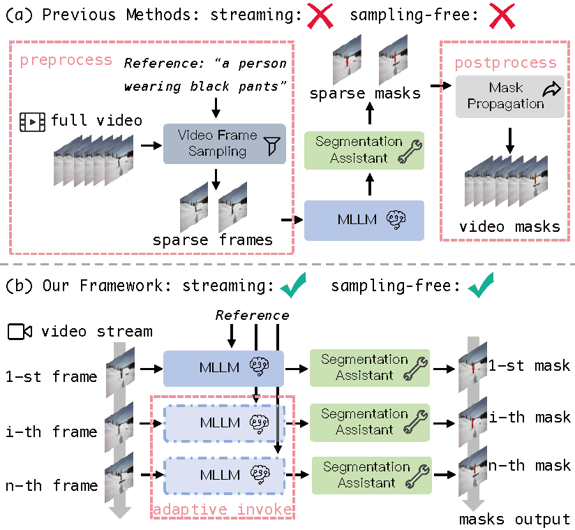
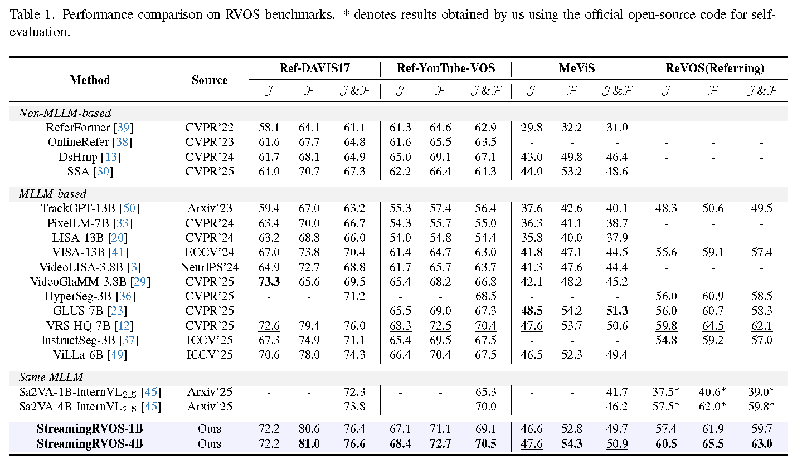

# Towards Streaming Referring Video Segmentation via Large Language Model

[\[📂 GitHub\]](https://github.com/wkzhang636/StreamingRVOS)
[\[📄 Paper\]](https://openaccess.thecvf.com/content/CVPR2026/papers/Zhang_Towards_Streaming_Referring_Video_Segmentation_via_Large_Language_Model_CVPR_2026_paper.pdf)
[\[🚀 Quick Start\]](#quick-start) 

## Network Architecture



## StreamingRVOS Performance
| Model Name | RefCOCO | RefCOCO+ | RefCOCOg | DAVIS | Ref-YTBVOS | MeVIS | REVOS(Referring) |
|:----------:|:-------:|:--------:|:--------:|:-----:|:----------:|:-----:|:----------------:|
| StreamingRVOS-1B | 80.3 | 75.0 | 77.5 | 76.4 | 69.1 | 49.7 | 59.7 |
| StreamingRVOS-4B | 82.5 | 77.9 | 79.9 | 76.6 | 70.5 | 50.9 | 63.0 |




## Dataset Structure

```
data/
├── video_datas
│   ├── revos
│   ├── mevis
│   ├── davis17
│   ├── sam_v_full          # please download from the SAM-2 official repo
│   └── sam_v_final_v3.json
├── ref_seg
│   ├── refclef
│   ├── refcoco
│   ├── refcoco+
│   └── refcocog
├── glamm_data
│   ├── images
│   └── annotations
├── osprey-724k
│   ├── Osprey-724K
│   └── coco
└── llava_data
    ├── llava_images
    ├── LLaVA-Instruct-150K
    └── LLaVA-Pretrain
```

## Pretrained Models

```
pretrained/
├── sam2_hiera_large.pt
├── InternVL2_5-1B
└── InternVL2_5-4B
```

## Quick Start

### Environment

```bash
conda create -n strvos python==3.10
conda activate strvos
pip install -r requirements.txt
```

### Train

```bash
# stage1
CUDA_VISIBLE_DEVICES=0,1,2,3 bash tools/dist.sh train projects/streamingrvos/configs/1b_stage1.py 4

# stage2 (edit stage1 ckpt path in config first)
CUDA_VISIBLE_DEVICES=0,1,2,3 bash tools/dist.sh train projects/streamingrvos/configs/1b_stage2.py 4
```

### Convert to HF

```bash
PYTHONPATH=. python projects/streamingrvos/hf/convert_to_hf.py config_path pth_path --save-path save_path
```

### Test

Supported datasets: `DAVIS` `MEVIS_U` `MEVIS` `REVOS` `REFYTVOS` `refcoco` `refcoco_plus` `refcocog`

```bash
CUDA_VISIBLE_DEVICES=0,1,2,3 PYTHONPATH=. python -m torch.distributed.launch --master_port=29500 --nproc_per_node=4 \
    projects/streamingrvos/evaluation/ref_vos_eval.py --launcher pytorch --model_path your_model_path --dataset DAVIS

CUDA_VISIBLE_DEVICES=0,1,2,3 PYTHONPATH=. python -m torch.distributed.launch --master_port=29500 --nproc_per_node=4 \
    projects/streamingrvos/evaluation/ref_vos_eval.py --launcher pytorch --model_path your_model_path --dataset REFYTVOS --submit

PYTHONPATH=. CUDA_VISIBLE_DEVICES=2 python projects/streamingrvos/evaluation/refcoco_eval.py --model_path your_model_path --dataset refcocog
```

### Eval

```bash
python tools/eval/eval_mevis.py  # edit dataset path and predicted path inside the script
```

## Acknowledgement

Our work is built upon [Sa2VA](https://github.com/bytedance/Sa2VA/releases/tag/v1). We thank the authors for their excellent open-source contribution.

## Citation

```bibtex
@InProceedings{Zhang_2026_CVPR,
    author    = {Zhang, Wenkang and Yang, Kaicheng and An, Xiang and Li, Qiang and Feng, Ziyong and Yang, Wankou and Deng, Jiankang},
    title     = {Towards Streaming Referring Video Segmentation via Large Language Model},
    booktitle = {Proceedings of the IEEE/CVF Conference on Computer Vision and Pattern Recognition (CVPR)},
    month     = {June},
    year      = {2026},
    pages     = {24598-24607}
}
```